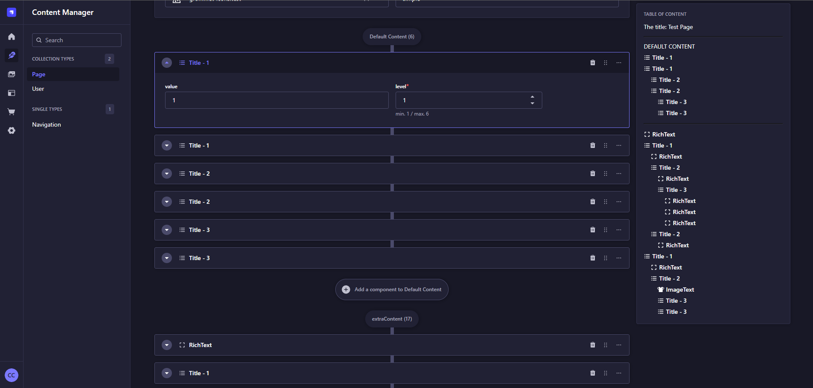

<div align="center" width="150px">
  
</div>
<div align="center">
  <h1>Strapi v5 - Plugin App Version</h1>
  <p>Strapi Plugin that displays your app version in the Strapi settings</p>
  <a href="https://www.npmjs.org/package/strapi-plugin-app-version">
    
  </a>
  <a href="https://www.npmjs.org/package/strapi-plugin-app-version">
    
  </a>
</div>

---

<div style="margin: 20px 0" align="center">
  
</div>

A plugin for [Strapi Headless CMS](https://github.com/strapi/strapi) that displays your app version in the Strapi settings

## Features
- Display your app version in the Strapi settings

## Usage

To configure the **App Version** plugin, add your configuration to the plugin settings. The configuration consist of an object with the version:

```typescript
type Config = {
  version: string
}
```

### Example Configuration

```typescript
// config/plugins.ts
import type { Config as AppVersionConfig } from 'strapi-plugin-app-version/dist/server/src/config'

import packageJson from '../package.json'

export default () => ({
  'app-version': {
    enabled: true,
    config: {
      version: packageJson.version,
    } satisfies AppVersionConfig,
  }
})
```
